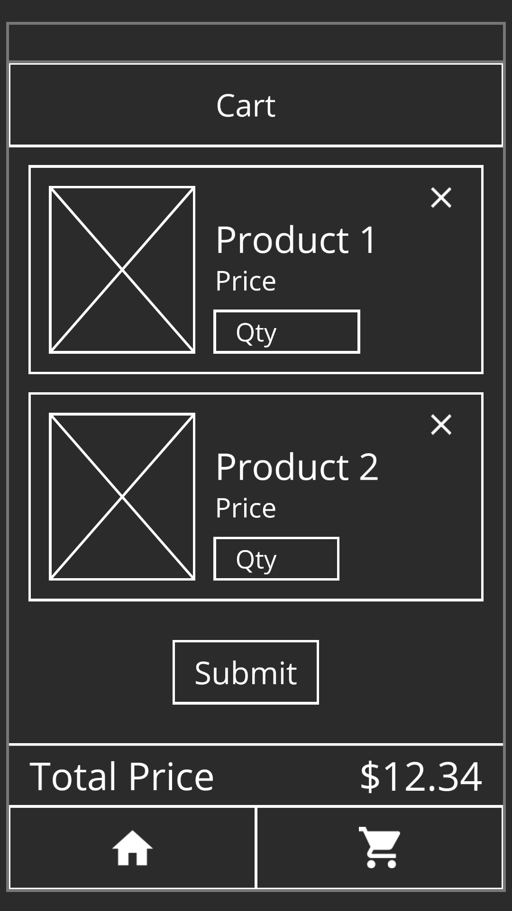

# Jaga-Me Tech Challenge

Complete the following challenge within a week.

## Functional Requirements

Create an iOS or Android application that allow JagaPros to 
1. search easily search for products from the JagaStore API
2. create a collection of products for a patient
3. display the estimated cost for the selected products
4. submit the selected products for Jaga-Me staff for processing

## Technical Requirements

1. React Native without Expo, on either iOS or Android
2. Data and state management
3. Include a build system

## Thought Process

As I have limited experience in developing in React Native and JavaScript, more time will be needed to spend doing research and figuring out how to piece everything together. As such, my goal is to deliver a barebones working application that meets only the minimum requirements.

## Design

The application will consist of 
- the Catalog screen, which houses the search, filter, and select functions
- the Cart screen, which lists the selected items, and allows the user to submit the selected items

Details of each section are below. Todo items are tagged according to priority (1 being highest priority)

### Screen Layout

- AppBar with secondary action button to the right of the title, if any,
- Page content
- Bottom tabs for navigating between catalog screen and cart screen

### Catalog page

- Applcation landing page
- AppBar includes the title "Catalog" and filter button. 
    - (2) Clicking on the filter button slides out the right drawer for users to choose additional filters
- (1) Search bar that filters out results based on whether name contains the search inputs
    - WooCommerce API does not seem to have search built in. For the purpose of the project. May need to just get all the products, then loop through to search for matching products
- (2) Chips bar. Additional filters selected will be displayed here. Users can remove filters by clicking on the x at the right of each chip.
- (1) Search result. Product results displayed as a list of cards
    - (1) Each card contains the image, product name and product price
    - (1) Card also contains an "Add" button, which will call up a dialog box for user to enter the quantity required and save. Upon saving, card will be removed.
        - (3) Note: Ideally, I would like the user to still see the card, but grayed out. This would allow the user to make changes directly on the catalog screen. But pushed to lower priority due to complexity.
    - (3) Clicking on the card will bring up a dialog box that provides the description of the product

### Cart page

- Accessed by clicking on the cart tab button on the bottom tabs
- (1) List of selected products. Can reuse component in Catalog page. User should be able to change quantity and remove items.
- (1) Total price.

