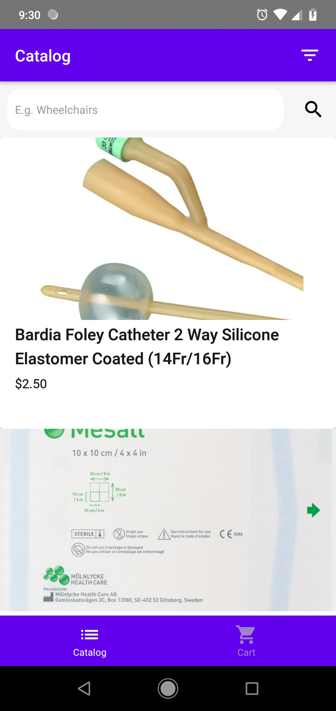
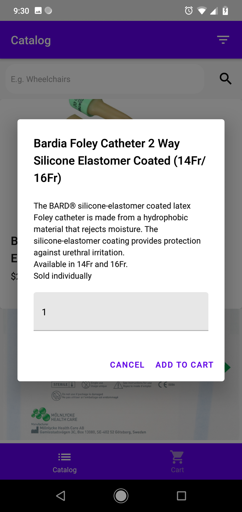
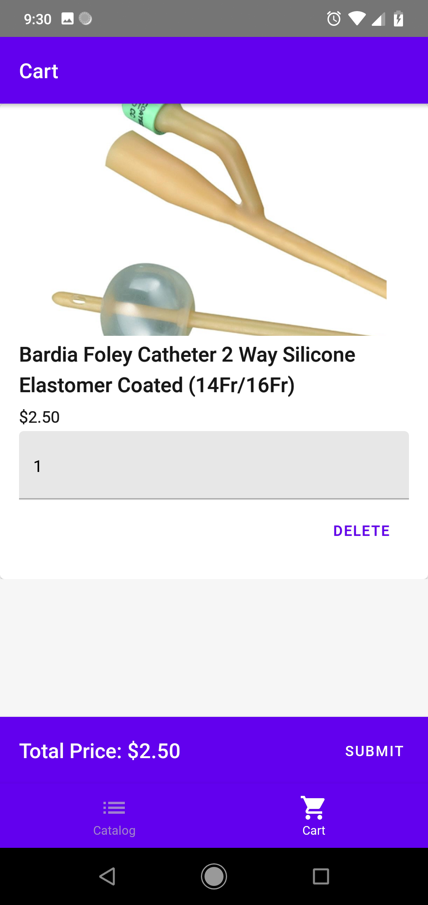
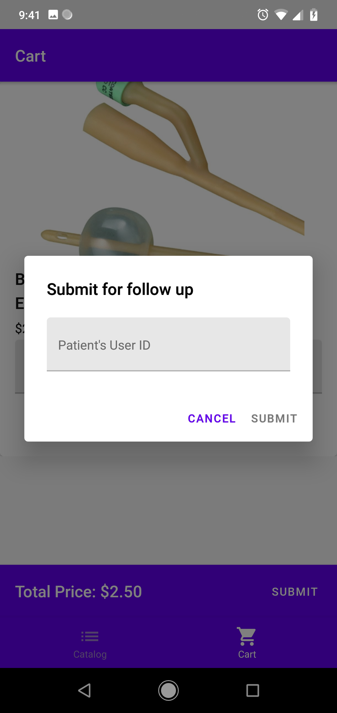

# Jaga-Me Tech Challenge

## 29-Nov-18

### Summary

Submission to webhook and search functions have been implemented in Redux Saga. 

Additional UI elements added in Catalog page to provide visual feedback on the search progress and results.

Added additional dialog in the submission of cart to provide additional visual feedback on the submission status.

### Outstanding tasks

As of the deadline, these are the remaining tasks that couldn't be completed.

- ~~(2) create filters drawer in catalog screen~~ This task is removed because I haven't been able to find ways to meaningfully filter the search results. 
- ~~(3) implement search calls based on filter to endpoint using Redux Saga~~ See previous point
- (4) update theme to match Jaga-Me branding

## 26-Nov-18

### Summary

Catalog and Cart pages, and the respective dialog boxes have been completed. The Redux store has been implemented as the single source of truth; all pages and dialog boxes affect each other's state only through the Redux store.

The reducer in the Redux store is currently a giant catch-all reducer for all actions. To consider refactoring such that actions and reducers are grouped into their pages. To compare whether it is better to simplify the store and move the business logic to the respective mappings of state and dispatcher to props, or move all business logic to the reducers and logic to the store.

### Remaining tasks

The outstanding items are sorted by priority. Given the amount of time left, I'm confident of completing the priority 1 items. Will check in again to see if priority 2 items can be completed.
- (1) implement submission to webhook using fetch API
- (1) implement search calls to endpoint using fetch API
- (2) wrap the above calls in Redux Saga
- (2) create filters drawer in catalog screen
- (3) implement search calls based on filter to endpoint using Redux Saga
- (4) update theme to match Jaga-Me branding

Below are the screenshots of the completed screens

**Catalog**

**Catalog - Add To Cart**

**Cart**

**Cart - Submit**

## 22-Nov-18

Complete the following challenge within a week.

### Functional Requirements

Create an iOS or Android application that allow JagaPros to 
1. search easily search for products from the JagaStore API
2. create a collection of products for a patient
3. display the estimated cost for the selected products
4. submit the selected products for Jaga-Me staff for processing

### Technical Requirements

1. React Native without Expo, on either iOS or Android
2. Data and state management
3. Include a build system

### Thought Process

As I have limited experience in developing in React Native and JavaScript, more time will be needed to spend doing research and figuring out how to piece everything together. As such, my goal is to deliver a barebones working application that meets only the minimum requirements.

### Design

The application will consist of 
- the Catalog screen, which houses the search, filter, and select functions
- the Cart screen, which lists the selected items, and allows the user to submit the selected items

Details of each section are below. Todo items are tagged according to priority (1 being highest priority)

#### Screen Layout

- AppBar with secondary action button to the right of the title, if any,
- Page content
- Bottom tabs for navigating between catalog screen and cart screen

#### Catalog page

##### Functions

- Applcation landing page
- AppBar includes the title "Catalog" and filter button. 
    - (2) Clicking on the filter button slides out the right drawer for users to choose additional filters
- (1) Search bar that filters out results based on whether name contains the search inputs
    - WooCommerce API does not seem to have search built in. For the purpose of the project. May need to just get all the products, then loop through to search for matching products
- (2) Chips bar. Additional filters selected will be displayed here. Users can remove filters by clicking on the x at the right of each chip.
- (1) Search result. Product results displayed as a list of cards
    - (1) Each card contains the image, product name and product price
    - (1) Card also contains an "Add" button, which will call up a dialog box for user to enter the quantity required and save. Upon saving, card will be removed.
        - (3) Note: Ideally, I would like the user to still see the card, but grayed out. This would allow the user to make changes directly on the catalog screen. But pushed to lower priority due to complexity.
    - (3) Clicking on the card will bring up a dialog box that provides the description of the product

##### Catalog Page - Main
(1) This page is displayed on launch or clicking the home button in the bottom tabs
- Clicking on ... on the AppBar dsplays the Search and Filter Menu
- (2) Chip bar (Filter 1) is displayed if there are any filters selected
    - Clicking on the 'x' button removes the filter, and updates the search results
- Clicking on the Search text input focuses the text input. As user enters the search text, search results will be updated when the user stops typing (i.e if user pauses for 500 ms)
- Clicking on the search results calls the Add to Cart Dialog

##### Catalog Page - Search and Filter Menu

(2) This page is shown on clicking the action button on the Catalog AppBar. 
- Min and Max Price text boxes, if filled, must be greater than 0, and Max Price must be greater than Min Price
- Clicking on the right arrow on the Search and Filter AppBar dismisses the menu
- Clicking on Clear Filters clears all text inputs and unchecks all checkboxes
- Clicking on Ok dimisses the menu, and updates the search results on the Catalog Page

##### Catalog Page - Add to Cart Dialog

(1) This dialog is displayed on clicking any of the search results on the Catalog Page - Main
- Clicking on Cancel dismisses the dialog
- Clicking on Add adds the item to the Cart and removes the item from the search results

#### Cart page

##### Functions

- Accessed by clicking on the cart tab button on the bottom tabs
- (1) List of selected products. Can reuse component in Catalog page. User should be able to change quantity and remove items.
- (1) Total price.
- (1) Submit selected items with the patient ID

##### Cart Page - Main
(1) This page is accessed by clicking on the the cart button on the bottom tabs
- Quantity of each item can be edited for each item
- Clicking on the 'x' button deletes the item
- Clicking on Submit calls the Submit dialog

##### Cart Page - Submit Dialog
(1) This dialog is diplayed on clicking the Submit button on Cart Page - Main.
- Patient's User ID must be entered in the text field
- Clicking on Cancel dismisses the dialog
- Clicking on Submit submits the collection and the user ID to the webhook

